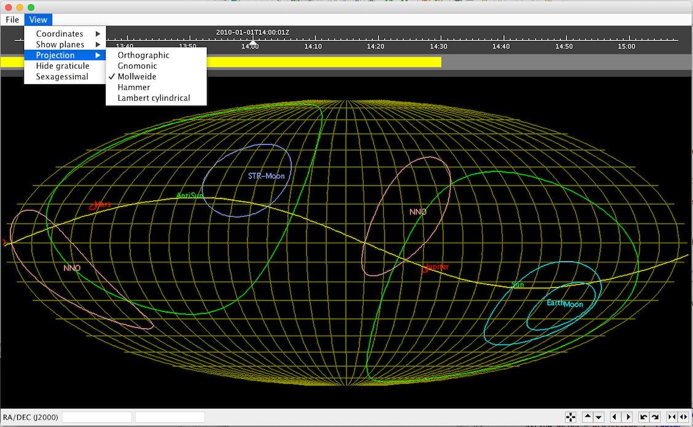

# GUSTO

Generic Uplink Software & Tools (GUSTO): A Java library for space astronomy.

### Overview

The library contains components from the scientific mission planning software of the Herschel space observatory which was used for interactive scheduling of astronomical observations. The library has since been enhanced and has been used to support other missions.

The core 'fltdyn' module provides support for time systems, orbit/ephemeris data, coordinate systems and associated maths. The 'gui' module provides components for building user interfaces with interactive sky projections and timelines. Finally, the 'demo' module contains some runnable demos to illustrate the features of the library and example code showing how to use specific features.

### Installation

GUSTO requires Java 1.8. It can be built using Maven as follows:

```
  git clone https://github.com/esa/GUSTO
  cd GUSTO
  mvn install
```

This creates the Maven modules `gusto-fltdyn`, `gusto-gui`, `gusto-demo` and `gusto-parent-pom`.

### Wish list

If time permits, a goal is to enhance the library to support newer versions of standards and to remove a few remaining Herschel-specific assumptions.

### Running the demos

*To be written*

A runnable JAR will be added to simplify running of the demo programs.



